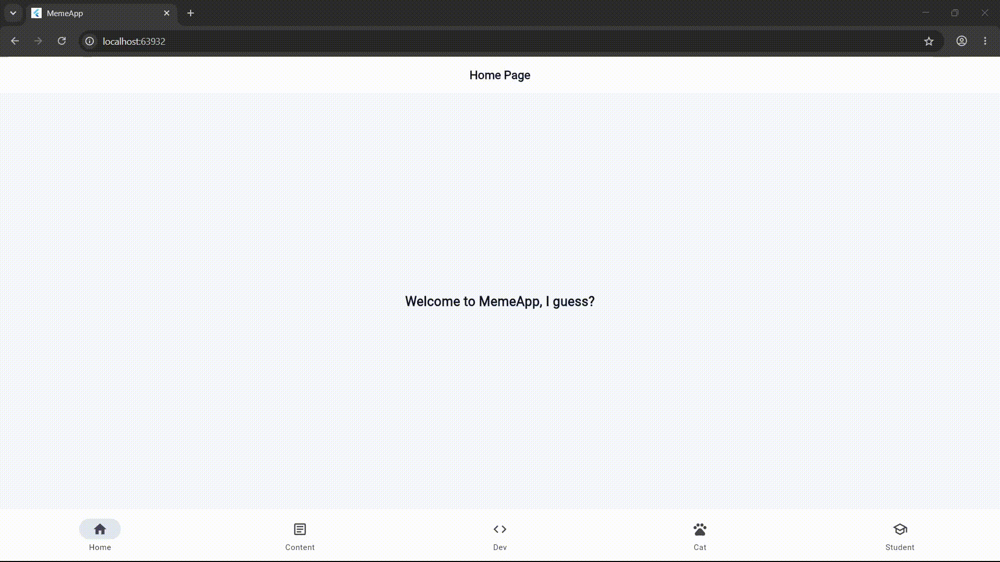

# 📱 MemeApp - Flutter Named Routing & Redirection Mockup

A minimalist Flutter application built to demonstrate **Named Route Configuration**, **Page Redirection using a Bottom Navigation Bar**, and **Modular Folder Structure**. Each screen features a clean centered text layout illustrating how redirection works.

---

## 🎬 App Demo



---

## 📑 Table of Contents
1. [Project Overview & Purpose](#-project-overview--purpose)
2. [What Each Screen Contains](#-what-each-screen-contains)
3. [Step-by-Step: How the App Works (Lifecycle)](#-step-by-step-how-the-app-works-lifecycle)
4. [The Navigation & Redirection Flow](#-the-navigation--redirection-flow)
5. [Why Redirection Works This Way (Code Explanation)](#-why-redirection-works-this-way-code-explanation)
6. [Folder Structure Breakdown](#-folder-structure-breakdown)
7. [Key Imports & Functions](#-key-imports--functions)
8. [🎓 Teacher Presentation & Defense Cheat Sheet](#-teacher-presentation--defense-cheat-sheet)

---

## 🌟 Project Overview & Purpose

The goal of this project is to showcase **how to implement redirection properly in Flutter using named routes**:
- Navigation between screens is handled entirely through the **Bottom Navigation Bar**.
- Each screen is a clean mockup with centered text.
- Tapping any destination in the navbar immediately redirects to that named route using `Navigator.pushReplacementNamed()`.

---

## 🖥️ What Each Screen Contains

| Screen | Route | Centered Content |
| :--- | :--- | :--- |
| **Home Page** | `'/'` | `"Welcome to MemeApp, I guess?"` |
| **Content Page** | `'/content'` | `"About MemeApp: This app is a mockup project designed to demonstrate how named routes, screen redirection, and clean folder structure work in Flutter using a bottom navigation bar."` |
| **Dev Meme Page** | `'/dev-meme'` | `💻 Developer Meme: "It works on my machine, so we are shipping my machine to production!"` |
| **Cat Meme Page** | `'/cat-meme'` | `🐱 Cat Meme: "You have 5 empty chairs, but I choose to sleep on your laptop keyboard."` |
| **Student Meme Page** | `'/student-meme'` | `🎓 Student Meme: "Due tomorrow at 11:59 PM means I start tomorrow at 11:30 PM."` |

---

## ⚙️ Step-by-Step: How the App Works (Lifecycle)

### 1. App Launch (`lib/main.dart`)
1. Flutter executes the `main()` entry function.
2. `main()` calls `runApp(const MemeApp())`, mounting the root `MaterialApp` widget.
3. `MaterialApp` reads:
   - `initialRoute: AppRoutes.home`: Sets `'/'` as the starting route.
   - `routes: AppRoutes.routes`: Registers the dictionary mapping all route strings to their widget constructors.
4. Flutter builds and displays the `HomePage`.

### 2. Rendering the Screen (`lib/screens/home_page.dart`)
1. `HomePage` builds a `Scaffold` containing:
   - An `AppBar` with the title "Home Page".
   - A `Center` widget showing `"Welcome to MemeApp, I guess?"`.
   - The `BottomNav(currentIndex: 0)` with the "Home" icon selected.

### 3. Redirection via Navbar (`lib/widgets/bottom_nav.dart`)
1. When the user taps another destination (e.g. **Content**, **Dev**, **Cat**, or **Student**):
2. `_onItemTapped(BuildContext context, int index)` is executed.
3. It calls:
   ```dart
   Navigator.pushReplacementNamed(context, AppRoutes.content);
   ```
4. Flutter looks up the route string in `AppRoutes.routes`, unmounts the previous page, and mounts the new destination screen.

---

## 🔄 The Navigation & Redirection Flow

```
                     ┌────────────────────────────────┐
                     │           App Launch           │
                     │  (initialRoute: AppRoutes.home) │
                     └───────────────┬────────────────┘
                                     │
                                     ▼
                    ┌─────────────────────────────────┐
                    │      HomePage  (Route: '/')     │
                    │ "Welcome to MemeApp, I guess?"  │
                    └────────────────┬────────────────┘
                                     │
                    ┌────────────────┴────────────────┐
                    │   Bottom Navigation Bar Taps    │
                    └───────┬────────┬────────┬───────┘
                            │        │        │
            ┌───────────────┘        │        └───────────────┐
            ▼                        ▼                        ▼
  ┌───────────────────┐    ┌───────────────────┐    ┌───────────────────┐
  │    ContentPage    │    │    DevMemePage    │    │    CatMemePage    │
  │   ('/content')    │    │   ('/dev-meme')   │    │   ('/cat-meme')   │
  │  "About MemeApp"  │    │  "Developer Meme" │    │    "Cat Meme"     │
  └───────────────────┘    └───────────────────┘    └───────────────────┘
```

---

## 🔀 Why Redirection Works This Way (Code Explanation)

### 1. `Navigator.pushReplacementNamed()`
```dart
Navigator.pushReplacementNamed(context, AppRoutes.content);
```
- **Function**: Replaces the current route on the navigation stack with the target route.
- **Why it's used**: For bottom navigation bars, switching between main destinations should replace the active screen rather than stacking pages infinitely. This ensures clean navigation without accumulating unnecessary back history.

### 2. Centralized Routing (`lib/routes/app_routes.dart`)
```dart
class AppRoutes {
  static const String home = '/';
  static const String content = '/content';
  static const String devMeme = '/dev-meme';
  static const String catMeme = '/cat-meme';
  static const String studentMeme = '/student-meme';

  static Map<String, WidgetBuilder> get routes => {
    home: (context) => const HomePage(),
    content: (context) => const ContentPage(),
    devMeme: (context) => const DevMemePage(),
    catMeme: (context) => const CatMemePage(),
    studentMeme: (context) => const StudentMemePage(),
  };
}
```
- **Benefit**: Keeps all route definitions in one place. If you ever rename a route or add a page, you only change it in `app_routes.dart`.

---

## 📂 Folder Structure Breakdown

```
lib/
│
├── main.dart                  # App entry point, MaterialApp, and Route registration
│
├── routes/                    # Routing & Redirection layer
│   └── app_routes.dart        # Named route string constants and routes map dictionary
│
├── widgets/                   # Reusable UI components
│   └── bottom_nav.dart        # Bottom Navigation Bar widget with redirection logic
│
└── screens/                   # Individual screen views
    ├── home_page.dart         # Home Screen ('/')
    ├── content_page.dart      # Content / About Screen ('/content')
    ├── dev_meme_page.dart     # Developer Meme Screen ('/dev-meme')
    ├── cat_meme_page.dart     # Cat Meme Screen ('/cat-meme')
    └── student_meme_page.dart # Student Meme Screen ('/student-meme')
```

---

## 📦 Key Imports & Functions

| Import / Function | Purpose in the Project |
| :--- | :--- |
| `import 'package:flutter/material.dart';` | Imports Flutter Material Design widgets (`Scaffold`, `AppBar`, `Center`, `Text`, `NavigationBar`). |
| `import '../routes/app_routes.dart';` | Imports the route string constants for safe navigation calls. |
| `Navigator.pushReplacementNamed()` | The core redirection function that swaps the current page with the target route. |
| `routes: AppRoutes.routes` | The route map dictionary passed to `MaterialApp` to define all valid application paths. |

---

## 🎓 Teacher Presentation & Defense Cheat Sheet

### Q1: "How does screen redirection work in this app?"
> **Answer:** "Our application uses Flutter's named routing system. In `app_routes.dart`, all routes are declared as constants and mapped to their corresponding screen widgets. When an item in `BottomNav` is tapped, `Navigator.pushReplacementNamed()` is called with the target route name to redirect the user to that screen."

### Q2: "Why use `pushReplacementNamed` instead of `pushNamed` in the bottom navbar?"
> **Answer:** "`pushReplacementNamed` swaps the active screen without adding new layers to the navigation history stack. This is best practice for bottom navigation bars so the user doesn't have to press 'Back' multiple times to exit after switching tabs."

### Q3: "What is the purpose of the `routes/` folder?"
> **Answer:** "It separates routing configuration from UI code. Rather than having hardcoded route strings scattered across multiple widgets, everything is centralized in `AppRoutes`, preventing typo bugs and making the code scalable."

---

## 🧪 Commands to Run & Test

```bash
# Run the application
flutter run

# Run static analysis (0 errors, 0 warnings)
flutter analyze

# Run automated tests
flutter test
```
